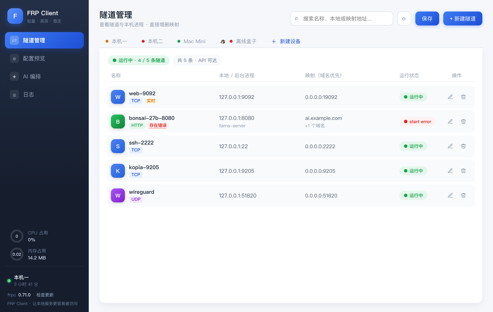
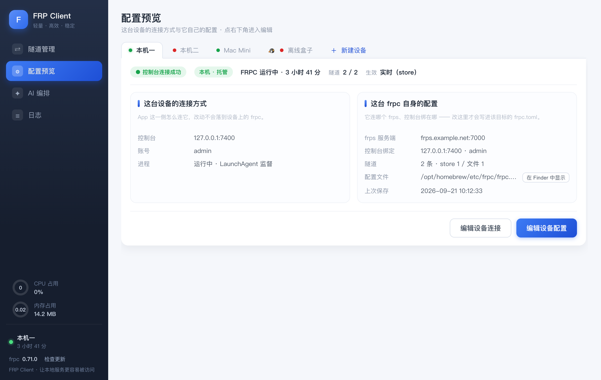
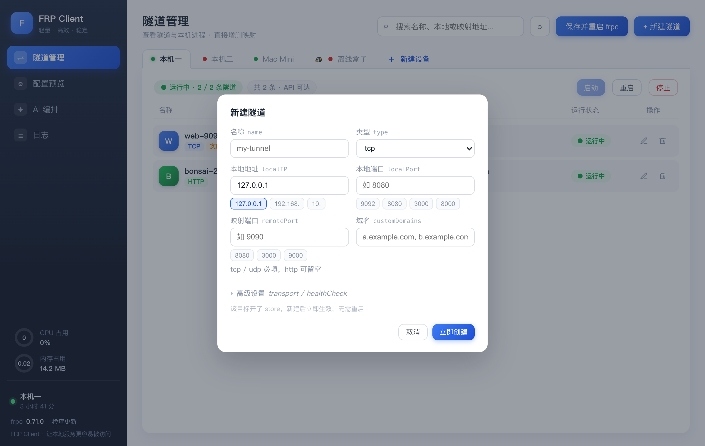

# FRP Client

> 轻量、高效的 [frp](https://github.com/fatedier/frp) 桌面客户端，用 Rust + Tauri 2 构建。

FRP Client 是一个原生桌面应用，用来管理**本机的多个 frpc 实例**和**远端的 frpc**，替代 frp 自带的 web 控制台。它直接读写 frpc 的 TOML 配置、调用 frpc 的 webServer API，让隧道的新建、修改、删除和生效在一个统一的界面里完成。

单二进制约 5 MB，压缩包约 2 MB，无内嵌浏览器之外的运行时依赖。

## 界面预览

### 隧道管理

一台设备一个页签，状态点实时反映每台 frpc 控制台的连通性与隧道健康度（绿 = 连通且正常，黄 = 有隧道异常，红 = 控制台连不通）。



### 配置预览

「App 怎么连这台设备」与「这台设备上的 frpc 自己的配置」分区呈现、分区编辑；写入前自动备份，失败自动回滚。



### 隧道编辑

新建 / 编辑共用一个弹窗，常用地址与端口提供预设 chip；字段标签中文，TOML 真实键名以小灰字并排。



## 功能特性

- **多目标管理**：本机多个 frpc 实例 + 远端 frpc 控制台统一切换；本机实例自动发现（扫描运行中 frpc 的 `-c` 参数、LaunchAgent plist 与常见配置路径）
- **双模式隧道 CRUD**：
  - frpc 开启 `[store]` 时（需 frpc 版本支持 store 能力，App 会自动探测），隧道的增删改直接走 `/api/store` REST，**实时生效、无需重启**
  - 未开启 store 时沿用暂存 TOML 流程，整篇保存后一次性生效
  - 两种模式的隧道列表自动合并为生效视图（同名以 store 为准）
- **配置可视化 ⇄ 原始 TOML**：表单与 TOML 双向换算，换算失败不允许切换页签；原始文本永远是唯一真相
- **安全写入**：保存前备份原配置、原子替换，重启后 15 秒就绪探测失败自动回滚
- **本机控制台地址闸门**：防止把远端地址误写进本机 frpc 的 `webServer.addr` 导致服务起不来
- **运行监控**：每台设备批量并发探活；本机 frpc 的 PID 之外还展示内存 / CPU 用量环、运行时长、二进制版本与 GitHub 最新 release 对比（可选更新检查）
- **启停接管**：本机的任意 frpc 实例都可以从 App 启动 / 停止 / 重启——LaunchAgent 托管的走 `launchctl`，未托管的按 `-c` 配置路径定位进程后 kill + 重新拉起；徽标如实区分「托管」与「独立进程」
- **凭据本地化**：设备凭据只存在 `~/.config/frp-client/app.toml`（权限 0600），不上传、不进入配置仓库
- **日志页**：查看本机 frpc 的 stdout / stderr，按字节区间从文件末尾向前分页加载，「加载更早」逐页追加且无重复 / 遗漏

## 平台支持

| 平台 | 安装包 | 说明 |
| --- | --- | --- |
| macOS 12+ | `.dmg` / `.app` | Apple Silicon 与 Intel |
| Windows 10+ | `.msi` / `.exe` (NSIS) | x64 |
| Linux | `.deb` / `.rpm` / AppImage | x86_64 |

Releases 页面提供 CI 自动构建的三平台安装包（见 `.github/workflows`）。

## 构建与开发

前置条件：

- [Rust](https://rustup.rs)（stable）
- Tauri 2 CLI：`cargo install tauri-cli --locked`
- 各平台系统依赖见 [Tauri 官方文档](https://tauri.app/start/prerequisites/)；Linux 需要 `libwebkit2gtk-4.1-dev libgtk-3-dev librsvg2-dev` 等

```bash
# 开发模式（热重载）
cargo tauri dev

# 发布构建（产出安装包）
cargo tauri build

# 测试
cargo test --release
```

前端是零构建的静态页面（`frontend/`，原生 JS + CSS），不需要 Node.js 工具链。

## 工作原理

```
┌─────────────┐   webServer API    ┌──────────┐   控制通道    ┌──────────┐
│  FRP Client │ ─────────────────► │   frpc   │ ────────────► │   frps   │
└─────────────┘   /api/config      └──────────               └──────────┘
       │          /api/store(可选)       ▲
       └──── TOML 读写 + 进程管理 ────────┘
```

- 对每台目标 frpc，App 通过其 `webServer`（默认 127.0.0.1:7400 一类地址）读取状态与配置、热加载或写入新配置
- 本机实例额外支持进程级信息（PID、内存、CPU、运行时长）与启动 / 停止 / 重启（托管走 launchctl，未托管按 `-c` 路径 kill + 拉起）
- 远端实例只做只读监控 + 配置热加载（frpc API 没有 start 端点，故不提供远端停止）

## 设计口径

- 单条隧道的新增 / 修改都在弹窗内完成，改哪项存哪项，不做整页重刷
- 本机专属信息（用量、版本、运行时长）只出现在侧边栏底部一处
- 远端设备不显示版本（frpc 控制台无版本端点，不引入额外通道）
- 界面标签中文，TOML / app.toml 真实键名以小灰字并排呈现

## Roadmap

- [x] 本机 frpc 启停接管（按 `-c` 路径 kill + 重新拉起）
- [x] 日志分页加载
- [ ] AI 编排：自然语言生成隧道配置（界面入口已预留）
- [ ] 国际化（当前仅中文）

## 许可证

[MIT](LICENSE)
